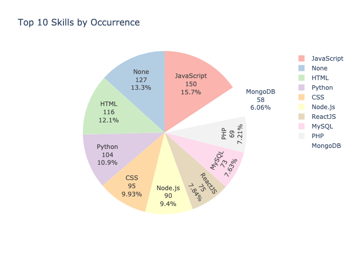
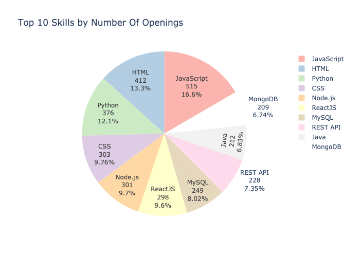
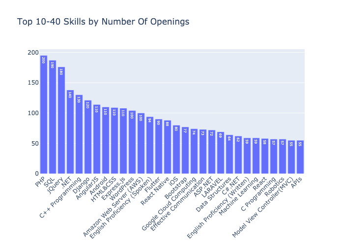
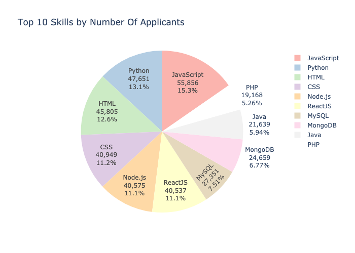
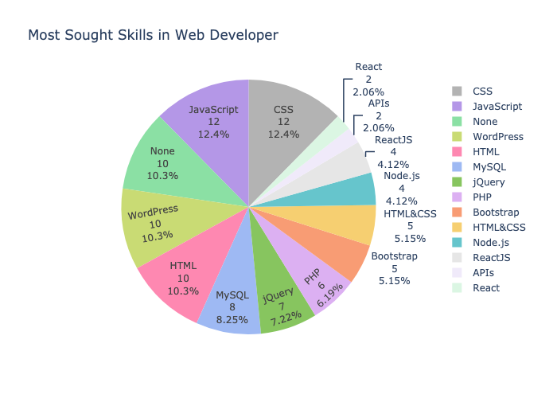
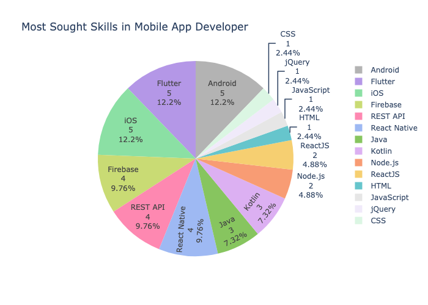
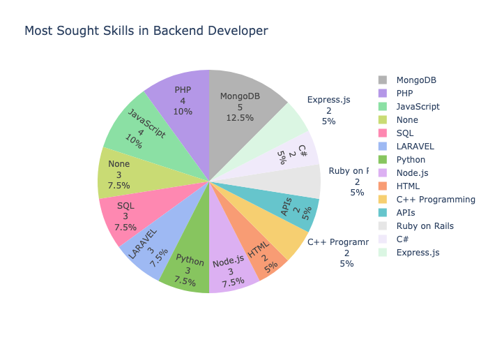
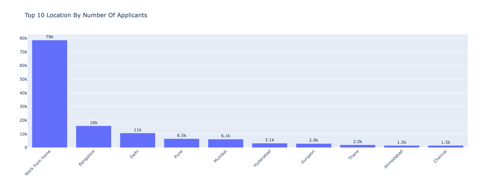
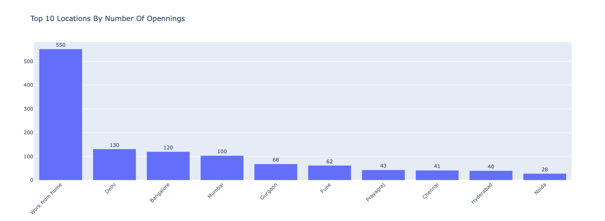
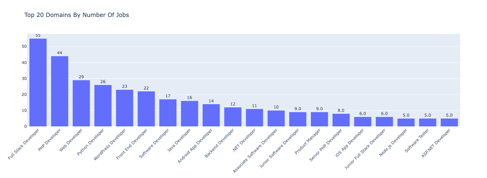

# Data Analysis and Webscrapping
Crawling and Analysis of Jobs on Job Portals - Internshala.

## Introduction
The project explores jobs in the current market. The dataset is built by scraping publically available web pages of Internshala. I have performed extensive data exploration, using various data science techniques. 

### Objectives
+ Build a high-quality dataset and develop an efficient data preprocessing pipeline 
+ Discover trends in current job market 
+ Highlight the areas of potential growth and improvement 
+ Understand current demands in the software industry, detect anomalies.

### About Libraries
My data collection strategy primarily consists of crawling individual pages(using selenium and requests library) at a time, as within the limitations of the respective robot.txt file for the website, and downloading the html page. Strategy is discussed in depth in later sections.
We have used Python as our language of choice, following best practices, guidelines  and conventions. Jupyter notebook for local modelling and exploration.

#### Frameworks used in this projects are:
+ Pandas
+ Sklearn
+ MLextension
+ Numpy
+ Plotly
+ Matplotlib 
+ Seaborn

#### Few observations from exploring Internshala dataset

